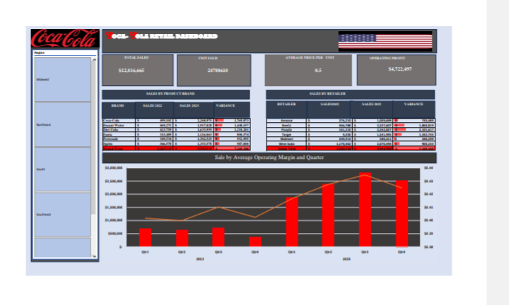

# Coca-Cola-Sales-Performance-Dashboard

# Project Overview

The Coca-Cola Sales Performance Dashboard is an interactive Excel dashboard designed to analyze sales performance across beverage brands, retailers, states, and time periods.

The dashboard transforms raw sales data into meaningful business insights through data visualization, KPI tracking, and trend analysis.

# Project Overview 
- Monitor overall sales performance.
- Analyze units sold across different products.
- Evaluate operating profit and business performance.
- Compare sales performance among retailers.
- Identify top-performing beverage brands.
- Track quarterly sales trends.
- Create an interactive dashboard for business decision-making.

# Dashboard Features

Key Performance Indicators (KPIs)

- Total Sales
- Units Sold
- Average Price per Unit
- Operating Profit

# Interactive Filters
Users can interact with the dashboard by filtering data based on:

- State
- Month
- Retailer

# Visualizations

- Sales by Beverage Brand
- Sales by Retailer
- Quarterly Sales Trends
- Operating Margin Analysis
- Variance Comparison

# Tools & Techniques Used

- Microsoft Excel
- Pivot Tables
- Pivot Charts
- Slicers
- Conditional Formatting
- Data Cleaning
- Data Transformation
- Dashboard Design

# Dataset Information

The dataset contains Coca-Cola retail sales records including:

- Beverage Brand
- Retailer
- State
- Sales Revenue
- Units Sold
- Operating Profit
- Operating Margin
- Date Information

# Key Business Insights

- Identified the highest-performing beverage brands based on sales revenue.
- Evaluated retailer performance across multiple locations.
- Analyzed sales trends over different quarters.
- Tracked operating profit and margin performance.
- Highlighted sales variations to support strategic decision-making.

## Dashboard Preview

# Skills Demonstrated

- Data Cleaning
- Data Analysis
- Data Visualization
- Dashboard Development
- Business Intelligence
- KPI Reporting
- Data Storytelling
- Problem Solving

# # Author

**Johnson Funmilayo Dorcas

# Data Analyst | AI Trainer | Data Annotation Specialist

LinkedIn: [https://www.linkedin.com/in/johnson-funmilayo-999b75219]

GitHub:(https://github.com/InsightFul27)

